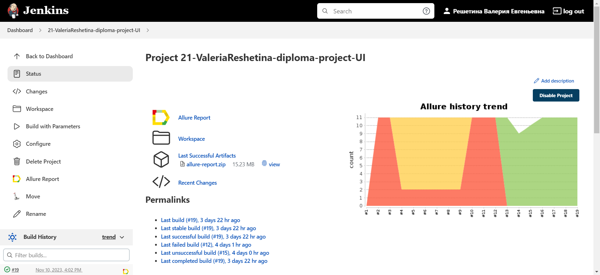
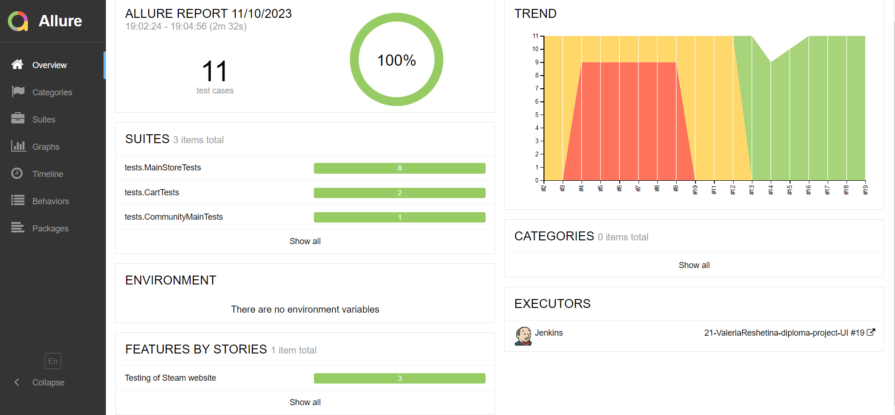
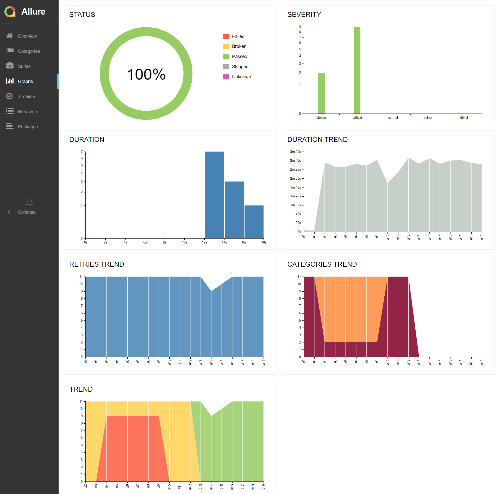
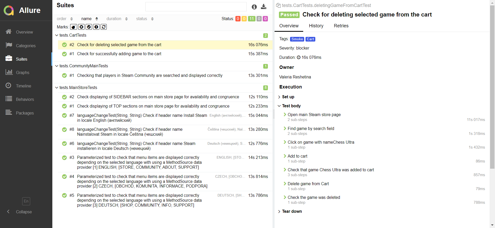
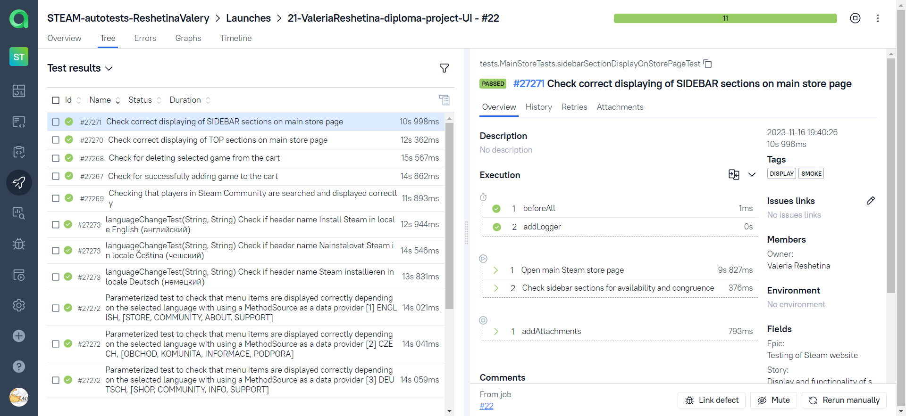
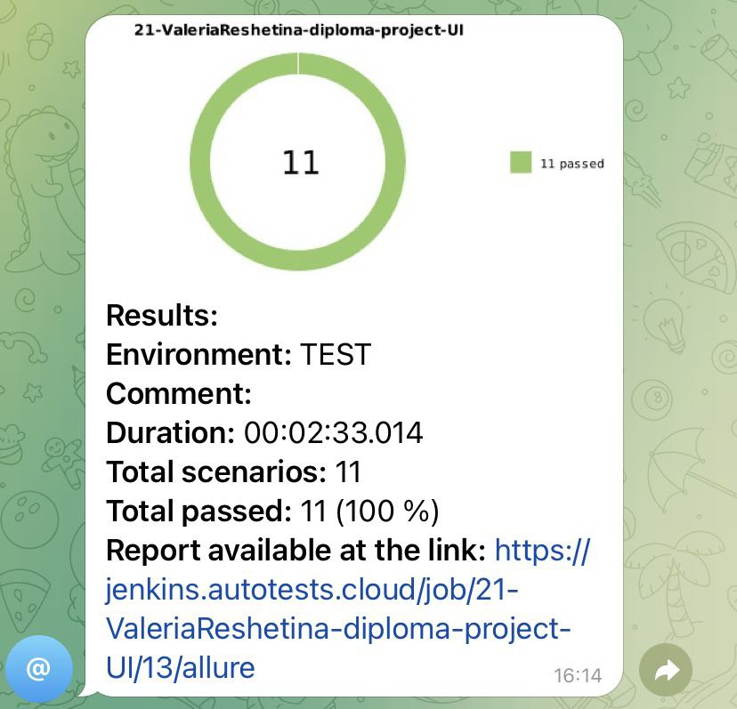

## Project with UI-tests for [Steam](https://store.steampowered.com/)

<p>
  
</p>

## Content

- [🛠️ Stack of technologies](#-stack-of-technologies)
- [📄 Description](#-description)
- [📋 List of UI tests](#-list-of-ui-tests)
- [🔌 Running tests from the terminal](#-running-tests-from-the-terminal)
- [🔧 Property files](#-property-files)
- [⚙️ Running tests in Jenkins](#-running-tests-in-jenkins)
- [📊 Test results report in Allure Report](#-test-results-report-in-allure-report)
- [🚀 Integration with Allure TestOps](#-integration-with-allure-testops)
- [🔗 Integration with Jira](#-integration-with-jira)
- [📣 Integration with Telegram](#-telegram-notifications-using-a-bot)
- [📹 Video of running tests](#-test-running-example-in-selenoid)

## 🛠️ Stack of technologies

<div style="text-align: center;">


</div>

## 📄 Description

This test project consists of UI tests and includes the following features:

- ✔️ **Page Object Pattern**: Utilizes the `Page Object` pattern for better test organization and maintenance.
- ✔️ **Parameterized Tests**: Employs parameterized tests to efficiently test multiple scenarios with different input
  values.
- ✔️ **Configuration Files**: Provides `local and remote configuration files` with properties for
  seamless test execution in different environments.
- ✔️ **Owner Library**: Uses the `Owner` library to handle application configuration through Java properties files,
  ensuring flexibility and ease of configuration management.
- ✔️ **Allure TestOps Integration**: Integrates with `Allure TestOps` for comprehensive test reporting and analytics.
- ✔️ **Autotests as Test Documentation**: The automated tests serve as living documentation, providing up-to

## 📋 List of UI Tests

### Cart Operations

- [x] Addition of item to cart
- [x] Deletion of item from cart

### Advanced Search

- [x] Check that players in Steam Community are searched and displayed correctly

### Display of UI-elements

- [x] Check correct displaying of Sidebar Sections on main store page
- [x] Check correct displaying of Top Sections on main store page

### Parameterized Tests

- [x] Parameterized test to check that menu items are displayed correctly depending on the selected language (Deutsch, English, Czech) with using a `MethodSource` as a data provider
- [x] Parameterized test to check that header on main page is displayed correctly depending on the selected language (Deutsch, English, Czech) with using a `CsvSource` as a data provider

## 🔌 Running tests from the terminal

To run tests from the terminal using Gradle, you can use the following commands:

```bash
gradle clean test -Denv='local'
```

When using the `local` environment, the tests will be executed locally on your machine.

```bash
gradle clean test -Denv='remote'
```

When using the `remote` environment, the tests will be executed remotely using Selenide.

By using the `-D` flag followed by the property name (`env` in this case) and its corresponding value (`local`
or `remote`), you can pass system properties to your tests during the Gradle execution. The tests can then access these
properties to determine the execution behavior based on the specified environment.

## 🔧 Properties

Local properties are in `local.properties` file:

```properties
baseUrl=
browser=
browserVersion=
browserSize=
```

>- *baseUrl* - base URL is for UI tests
>- *browser* - it's a choice of browser for UI tests
>- *browserVersion* - browser and it's version
>- *browserSize* - size of browser
> - *selenoidUrl* - URL for remote WebDriver (Selenoid)

Remote properties are in `remote.properties` file:

```properties
baseUrl=
browser=
browserVersion=
browserSize=
remoteUrl=
selenoidAuth=
```

It is needed to adapt remote.properties files locally based on your credentials to remote Selenoid.

##  Running tests in [Jenkins](https://jenkins.autotests.cloud/job/Students/job/18-alin_laegnor-luma_ui_tests/)

To execute the tests in Jenkins, use the following command:

```bash
clean
test
-Dbrowser=${BROWSER}
-DbrowserSize=${BROWSER_SIZE}
-DbrowserVersion=${BROWSER_VERSION}
-DselenoidUrl=${SELENOID_URL}
-DbaseUrl=${BASE_URL}		
```

This command includes various system properties that are used to configure the test execution in Jenkins:

- `-Dbrowser=${BROWSER}`: Specifies the browser to be used for the test
  execution.
- `-DbrowserSize=${BROWSER_SIZE}`: Defines the browser window size.
- `-DbrowserVersion=${BROWSER_VERSION}`: Specifies version of the browser to be used for the test
  execution.
- `-DremoteDriverUrl=${SELENOID_URL}`: Specifies the URL of the remote WebDriver, such as Selenium Grid or Selenoid.
- `-DbaseUrl=${BASE_URL}`: Sets the base URL for the application under test.

Make sure to replace `${BROWSER_VERSION}`, `${BASE_URL}`, `${BROWSER_SIZE}`, and `${SELENOID_URL}` with the
appropriate values based on your Jenkins configuration and test requirements.

Main page of the build:

<div style="text-align: center;">
  
</div>

##  Test results report in [Allure Report](https://jenkins.autotests.cloud/job/21-ValeriaReshetina-diploma-project-UI/allure/)

It is possible to switch from <code><strong>Jenkins</strong></code> to reports generated by <code><strong>
Allure</strong></code>.

<div style="text-align: center;">
  
</div>

Allure dashboard with statistics

<div style="text-align: center;">
  
</div>

Grouping of tests by checked functionality

<div style="text-align: center;">
  
</div>

##  Integration with [Allure TestOps](https://allure.autotests.cloud/launch/32151)

<div style="text-align: center;">
  
</div>

##  Integration with [Jira](https://jira.autotests.cloud/browse/HOMEWORK-708)

<div style="text-align: center;">
  
</div>

##  Telegram notifications using a bot

After passing all the tests, an automatic report is sent to the <code>Telegram Notification Bot</code>.

<div style="text-align: center;">
    
</div>

##  Test running example in Selenoid

A video is attached to each test in the Allure report.

<div style="text-align: center;">
  
</div>


Moreover, in each test run of the Allure report you can see <code>Browser console logs</code> and <code>Page
source</code>.

[Back to content](#content)